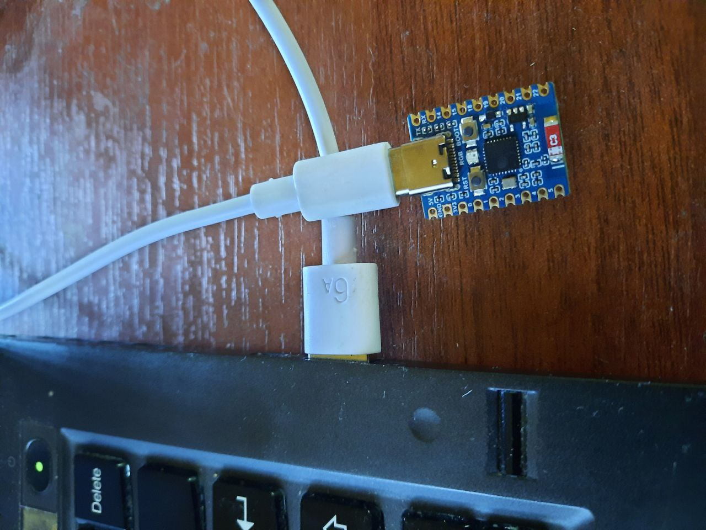
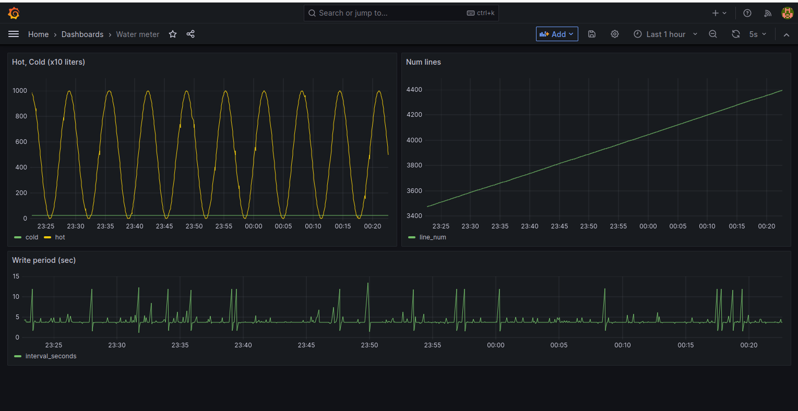
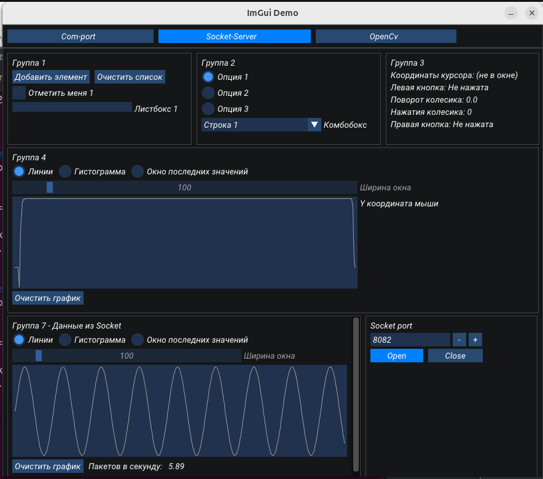

# Esp32c3_test

## Описание
- Тестирование передачи данных по uart.
- Тестирование http соединения микроконтроллера ESP32C6 с удаленным сервером через wifi. 
Каждые 3 секунды на сервер улетает Post-запрос с несколькими параметрами. 
Один из параметров меняется по синусу от 0 до 1000.
- Тестирование соединения и передачи данных через web-socket 

## Требования
- ESP-IDF (v4.x)
- Плата разработки ESP32-C6 SuperMini (https://aliexpress.ru/item/1005006917431375.html?sku_id=12000038720440763&spm=a2g2w.productlist.search_results.13.68fb4af2fHbNJE)
- Visual Studio Code (с установленными расширениями)

## Картинка

### Отладочная плата со встроенным uart-usb преобразователем. 

### Визуализация данных отправленных на сервер в реальном времени

### Окно приложения с графическим интерфейсом для связи с esp32

[Графический интерфейс для связи с esp] https://github.com/bauman-robotics/ImGui_OpenCv

## Сборка и прошивка

1. Установите ESP-IDF, следуя инструкциям на официальном сайте: https://docs.espressif.com/projects/esp-idf/en/latest/esp32/get-started/index.html

2. Установите Visual Studio Code и установите рекомендуемые расширения:
    - `espressif.esp-idf-extension`
    - `ms-vscode.cmake-tools`
    - `ms-vscode.cpptools`
    - `ms-vscode.vscode-serial-monitor`

3. Склонируйте репозиторий:

sh git clone https://github.com/bauman-robotics/esp32c3_http cd esp32c3_test
4. Откройте проект в Visual Studio Code:

sh code .

5. Настройте проект:

sh idf.py menuconfig

6. Соберите проект:

sh idf.py build

7. Прошейте микроконтроллер:

sh idf.py flash

8. Мониторинг последовательного порта:

sh idf.py monitor

### Минимальная установка для прошивки бинарного файла

Если вы хотите прошить только бинарный файл и не хотите устанавливать полный набор инструментов ESP-IDF, следуйте этим шагам:

1. Установите `esptool.py`:

sh pip install esptool
2. Скачайте бинарный файл прошивки:
    - [Скачать файл прошивки](http://84.252.143.212:5100/download/esp32c3_http.bin)

3. Подключите вашу плату ESP32-C6 к компьютеру через USB.

4. Определите порт, к которому подключена плата (например, `/dev/ttyACM0` на Linux или `COM3` на Windows).

5. Прошейте микроконтроллер с помощью `esptool.py`:

sh esptool.py --chip esp32c6 --port /dev/ttyACM0 --baud 115200 write_flash -z 0x1000 path/to/your/file.bin
6. Мониторинг последовательного порта:

sh screen /dev/ttyUSB0 115200

## Использование

### Конфигурация RGB светодиода

Для платы разработки ESP32-C6 SuperMini, RGB светодиод управляется по SPI через GPIO_NUM_8:

- Данные (Data): GPIO_NUM_8

## Бинарные файлы

Бинарные файлы можно скачать по следующей ссылке:

- [Скачать файл](http://84.252.143.212:5100/download/esp32c3_http.bin)

## Визуализация данных на сервере 

Посмотреть отправляемые данные на в режиме реального времени на сервере можно по ссылке:

- [ RealTime Visualization](http://84.252.143.212:3000/d/cbaf65f8-3432-48d1-b84c-820fd1536128/water-meter?orgId=1&from=1726762044615&to=1726765644615&refresh=5s)

